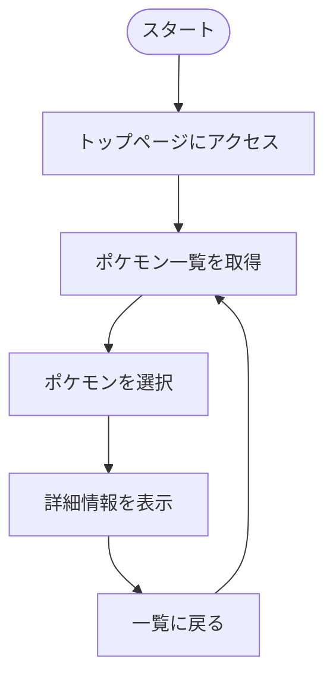
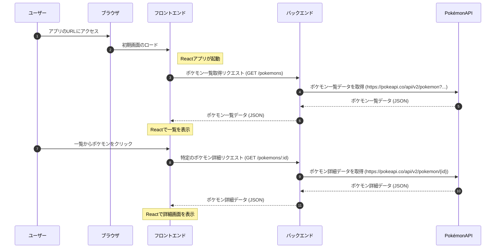
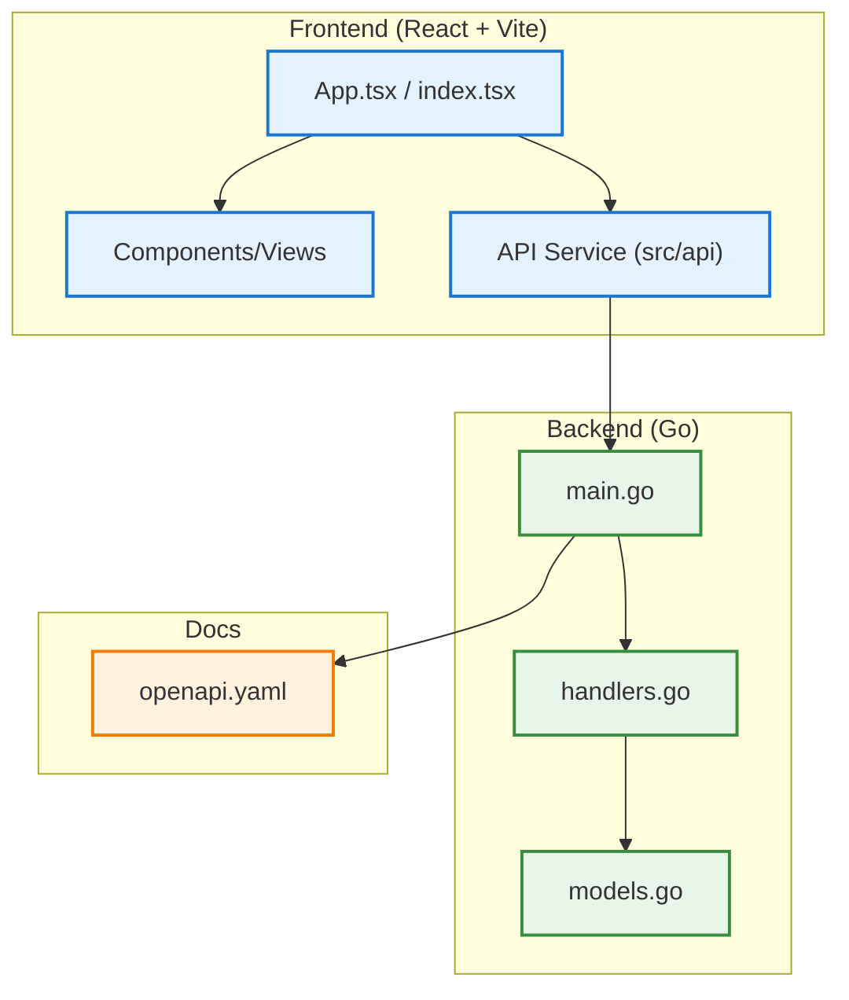

# Pokemon Viewer Golang 


<br>

### Go + React + Vite によるポケモン図鑑アプリをチーム開発で実装

### ポケモンAPIから取得した情報を、一覧表示・詳細表示で閲覧可能

<br>

## ⭐ デモ動画

<br>

### 一覧表示のデモ動画

<br>


<br>

### 詳細表示のデモ動画

<br>


<br>


## **📝 サービス紹介と導入ガイド**


- [サービスの特徴・開発の目的](#サービスの特徴・開発の目的)

- [セットアップ手順](#セットアップ手順)

- [基本的な使い方](#基本的な使い方)

<br>

## **🛠️ 技術構成**


- [システム全体の構成図](#システム全体の構成図)

- [使用技術](#使用技術)

- [フォルダ構成図](#クラス構成とモジュール設計)


<br>

## **💡 開発の振り返りと展望**


- [設計上のこだわり](#設計上のこだわり)

- [苦労した点](#苦労した点)

- [追加予定の機能](#追加予定の機能)

<br>

## **📚 出典・ライセンス**


- [参考文献](#参考文献)

- [ライセンス情報](#ライセンス情報)

<br>

---

## <a id="サービスの特徴・開発の目的"></a> 📝 サービスの特徴・開発の目的

<br>

###  サービスの全体像

- このプロジェクトは、**ポケモンの情報を閲覧できるWebサービス**です。

- ユーザーは一覧からポケモンを選び、詳細情報（タイプ・能力・ステータスなど）を確認できます。


<br>

###  できること

- **ポケモン一覧の表示**

  PokeAPIから取得したポケモン情報を一覧で表示し、名前や画像を閲覧可能
  
- **詳細情報の閲覧**

  任意のポケモンをクリックすると、タイプ・能力・ステータスなどの詳細情報を表示
  
- **API通信によるリアルタイム取得**

  フロントエンドとバックエンドが連携し、最新のデータをリアルタイムで取得・表示


<br>

###  作成のきっかけ

<div style="height:8px;"></div>

1. **課題意識**

     Go言語とReactを用いたWeb開発を、チームで分担・連携しながら実践的に学ぶことを目的としました。

2. **解決アプローチ**

     バックエンド（Go）とフロントエンド（React + Vite）をチームで分担し、<br>

     API設計・データ取得・UI表示までの一連の流れを協力して構築。
     
4. **得られた学び**

      API開発・ドキュメント整備・フロントとの疎通確認などを通じて、<br>

     チーム開発における役割分担やコミュニケーションの重要性を実感しました。

<br>

---


## <a id="セットアップ手順"></a> 🚀 セットアップ手順

<br>

### 1. 前提条件

以下を事前にインストールしてください

- [Go](https://go.dev/doc/install)

- [Node.js](https://nodejs.org/ja/)

- [Git](https://git-scm.com/)

<br>

### 2. リポジトリのクローン

以下のコマンドをターミナルで実行します

```bash
git clone git@github.com:BackendExplorer/Pokemon-Viewer-Golang.git
```
```bash
cd Pokemon-Viewer-Golang
```

<br>

---

## <a id="基本的な使い方"></a>🧑‍💻 基本的な使い方

<br>

### フロントエンド起動

```bash
cd frontend
```
```bash
npm install
```
```bash
npm run dev
```

<br>

### バックエンド起動

```bash
cd backend
```

```bash
go run .
```

<br>

### アクセス

http://localhost:5173 でアクセス可能です。

<br>

### ユーザーの操作手順




<br>

---

## <a id="システム全体の構成図"></a>⚙️ システム全体の構成図

<br>



<br>


<br>

---


## <a id="使用技術"></a>🧰 使用技術

<br>

### 1. 技術選定の理由

- **`Go`**

  シンプルで高速な処理が可能な言語であり、APIサーバ構築に適しているため採用。<br>

  標準ライブラリが充実しており、余計な依存なしでHTTP通信を実装可能なため

- **`net/http`**

  軽量かつ柔軟なWebサーバ構築が可能で、REST APIの実装に十分な機能を備えているため

- **`React`**

  コンポーネントベースの開発により保守性が高く、ユーザー体験のよいSPAを構築できるため

- **`Vite`**

  高速な開発サーバとビルド処理を提供し、開発効率を重視して導入

- **`TypeScript`**

  型安全性と可読性の向上を目的に導入し、チーム開発におけるバグの抑制に貢献するため

- **`GitHub`**

  ソースコードをチームで共有・管理するために使用し、開発履歴の可視化やレビューの効率化を図るため


<br>

### 2.  技術スタックと 開発環境 の全体像

<br>

| カテゴリ       | 採用技術 と 使用ツール                                                                                              |
|----------------|----------------------------------------------------------------------------------------------------------------------|
| 開発言語       |   <br>標準ライブラリ使用：`net/http`, `encoding/json` |
| フロントエンド |   <br>SPA構成で動的にデータを表示 |
| テストツール   |  <br>APIの動作確認やエンドポイント検証に使用 |
| バージョン管理 | &nbsp;&nbsp;&nbsp;&nbsp; |
| 描画ツール     |  <br>ユーザー操作や処理フローを視覚化 |
| 開発環境       | &nbsp;&nbsp;&nbsp;&nbsp; |


<br>

---

## <a id="クラス構成とモジュール設計"></a>📌 フォルダ構成図

<br>



<br>

---

## <a id="設計上のこだわり"></a>🌟 設計上のこだわり

<br>

<ul>
  <li>
    <p>ポケモンの情報は、APIからそのまま使うのではなく、</p>
    <p><strong>一度Goの構造体に入れて整理し、それをフロントエンド用に分かりやすく変換</strong>しています。</p>
    <p>これにより、クライアント側での処理がシンプルになり、パフォーマンスや保守性の向上にもつながります。</p>
    <p>詳しいデータ構造やレスポンス仕様については、<a href="./docs/openapi.yaml">APIドキュメント</a>をご覧ください。</p>
  </li>
</ul>


<br>

---

## <a id="苦労した点"></a> ⚠️ 苦労した点

<br>

### PokeAPI のデータ取得と構造体変換

<br>

- **課題点**

  PokeAPI のレスポンスはネスト構造が多く、一覧取得では「リスト → 各ポケモン詳細」を順番に取得する必要
  
  がありました。また、取得したデータはそのままでは扱いづらく、フロントエンド用に整形する処理も加える

  必要がありました。この二段階取得とデータ変換の両立が、実装の複雑さにつながっていました。

<br>

- **解決アプローチ**

  API のレスポンスはまず `PokemonResponse` 構造体にマッピングし、そこから必要なフィールドだけを抽出し
  
  て、フロントで扱いやすい `Pokemon` や `PokemonDetail` に再構成する方針としました。
  
  一覧取得時は、`PokemonListResponse` から名前とURLを取り出し、それぞれの詳細情報を
  
  個別に取得してまとめ直しました。各 HTTP リクエストでは `defer res.Body.Close()` を徹底し、
  
  エラーが発生した場合も処理全体が止まらないようにしています。

<br>

- **得られた成果**

  フロントエンドは必要な項目だけがまとまったシンプルな JSON を受け取れるようになり、
  
  実装や保守がしやすくなりました。
   
  二段階取得であっても安定して動作し、メモリリークなどの問題も発生しない堅牢な構成を実現できました。

<br>

---

## <a id="追加予定の機能"></a> 🔥 追加予定の機能

<br>

<ul>
  
  <li>
    <h3>ポケモン検索機能の追加</h3>
    <p>現在は一覧表示のみのため、特定のポケモンを素早く探す手段がありません。</p>
    <p>この課題に対し、名前による検索が可能なエンドポイントを新たに追加し、</p>
    <p>キーワードをもとに該当ポケモンの情報を返す仕組みを実装予定です。</p>
    <p>フロントエンドには検索フォームを設置し、SPA内での検索体験を実現します。</p>
    <p>これにより、目的のポケモンに直接アクセスできる利便性が向上し、ユーザー体験の改善が期待できます。</p>
  </li>
</ul>

<br>


---

## <a id="参考文献"></a>📗 参考文献

<br>

### 公式ドキュメント

- [Go言語 公式ドキュメント](https://go.dev/doc/)

  `Goの基本構文` やツールチェーン（go run / go build など）を学ぶために参照

- [Goパッケージリファレンス](https://pkg.go.dev/)

  `標準ライブラリ`（net/http, encoding/json など）の関数仕様や使い方を調べる際に参照

- [React 公式ドキュメント](https://ja.react.dev/)

  `コンポーネントの定義・状態管理` など、React の基本的な概念を確認するために参照

- [TypeScript 公式ドキュメント](https://www.typescriptlang.org/ja/docs/)

  `型アノテーション` や `インターフェース` の使い方などを把握するために参照


<br>

### 参考にしたサイト

- [少しずつ育てるGo言語のプロジェクト構成](https://zenn.dev/foxtail88/articles/824c5e8e0c6d82)

- [pokemon APIを使用し、日本語入力のポケモン名を検索・画像表示する機能を作成](https://zenn.dev/kingdom0927/articles/52fd1d317b7f3d)

- [GitHubのissueとcommitを紐付ける - Qiita](https://qiita.com/cotolier_risa/items/210db74e6496d4359be7)

- [2.2 詳細 API 取得｜Nuxt3 + PokeAPIでポケモン図鑑を作ろう！](https://zenn.dev/tsukiyama3/books/pokedex-handson/viewer/data-fetching-detail
)


<br>

---

## <a id="ライセンス情報"></a>📜 ライセンス情報

<br>

<ul>
  <li>
    本プロジェクトの全コード・構成・図・UIなどの著作権は、制作者である Tenshin Noji に帰属します。<br><br>
    採用選考や個人的な学習を目的とした閲覧・参照は歓迎しますが、<br><br>
    無断転載・複製・商用利用・二次配布は禁止とさせていただきます。<br><br>
    ライセンス全文はリポジトリ内の <a href="./LICENSE.md" target="_blank">LICENSEファイル</a>をご覧ください。
  </li>
</ul>

<br>
