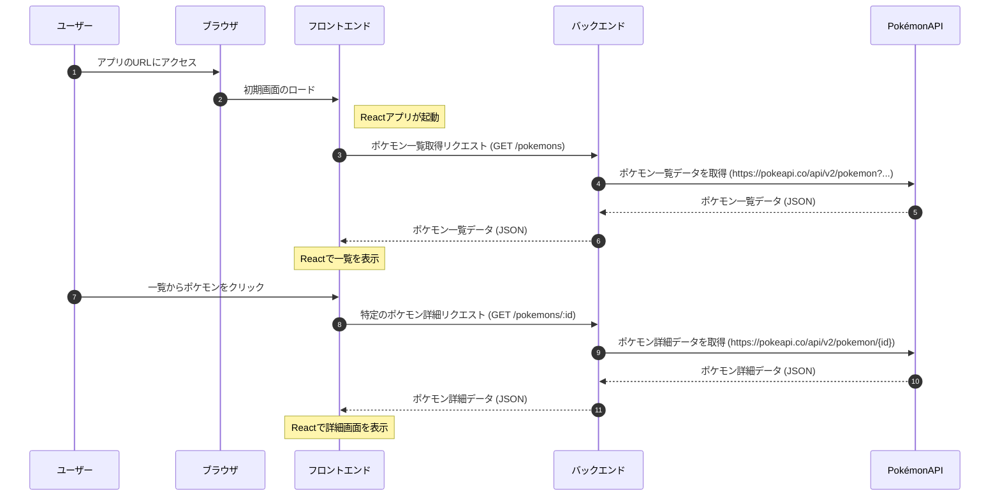

# 🌐 Pokemon-Viewer-Golang 🔍  

<br>

**ポケモンAPIから取得した情報を閲覧できる Golang 製 Web アプリ**

<br>

## 🖥 デモ

<br>

https://github.com/user-attachments/assets/5894cd75-e0ca-41b2-be5c-30b4d4ea33a2

<br>

## **📝 概要**

- [説明](#説明)

- [利用方法](#利用方法)

- [機能一覧](#機能一覧)

<br>

## **🛠 技術関連**

- [処理フロー](#処理フロー)

- [API仕様](#-api仕様)

- [使用技術](#使用技術)

<br>

## **💡 開発のポイント**

- [こだわりのポイント](#こだわりのポイント)

- [苦労した点](#苦労した点)

- [さらに追加したい機能](#さらに追加したい機能)

<br>

## **📚 参考情報・ライセンス**

- [参考文献](#参考文献)

- [ライセンス](#ライセンス)

<br>

---
## <a id="説明"></a>📝 説明


このアプリケーションは、PokeAPI から取得したポケモン情報を検索・表示するシンプルな Web アプリです。Go（Golang）で構築したバックエンドと React + Vite を用いたフロントエンドが連携し、以下の特徴を持ちます。

- **高速・軽量なバックエンド**  

  Go の特性を活かしてポケモン一覧や詳細情報を素早く取得・加工し、フロントエンドへ返却します。

- **直感的なフロントエンド**  

  React + Vite によるシンプルな UI で、一覧表示から詳細確認までスムーズに操作できます。

<br>

## <a id="利用方法"></a>📖 利用方法


### 1. 前提条件
- Go 1.20以上  

- Node.js 18.x以上  

- npm または yarn  

- Git  


### 2. クローン

```bash
git clone https://github.com/BackendExplorer/Pokemon-Viewer-Golang.git
```

```bash
cd Pokemon-Viewer-Golang
```


### 3. フロントエンドの起動

```bash
cd frontend
```

```bash
npm install
```

```bash
npm run dev
```


### 4. バックエンドの起動

```bash
cd backend
```

```bash
go run .
```


### 5. アクセス

[http://localhost:5173](http://localhost:5173) でアクセス可能です。


<br>


---
## <a id="機能一覧"></a>⚙️機能一覧

本アプリでは、以下の機能を利用できます。

- ポケモン一覧表示  
  ポケモンの名前やアイコンなどを一覧で確認できます。
- ポケモン詳細表示  
  各ポケモンのタイプ、能力、ステータスなどを個別に確認できます。

下のスクリーンショットは、左が「ポケモン一覧画面」、右が「ポケモン詳細画面」の例です。

|  |  |
| --- | --- |

<br>

---


## <a id="処理フロー"></a>🔄 処理フロー





<br>

---
## <a id="API仕様"></a>🔌 API仕様

- APIドキュメント：https://github.com/BackendExplorer/Pokemon-Viewer-Golang/blob/main/docs/openapi.yaml

<br>

---

## <a id="使用技術"></a>🧰 使用技術

| カテゴリ   | 技術スタック       |
|------------|--------------------|
| 開発言語   | Go, TypeScript     |
| フロントエンド | React, Vite       |
| バージョン管理 | Git, GitHub        |

<br>

---

## <a id="こだわりのポイント"></a>⭐️ こだわりのポイント

- 保守性と拡張性を意識し、機能ごとにファイルを分割して実装しました。

- 外部API（PokeAPI）との連携を通して、リアルタイムデータの取得やAPI通信処理を学びました。

- ページネーション機能やCORS設定など、実務を意識した構成にこだわりました。

<br>

## <a id="苦労した点"></a>⚠️ 苦労した点

- 複数のAPIを連続で呼び出す際のエラーハンドリングとパフォーマンス調整に苦労しました。

- クエリパラメータの処理やバリデーションで、細かい条件分岐やエッジケースの対応が必要でした。

<br>

## <a id="さらに追加したい機能"></a>🔥 さらに追加したい機能

- Redisなどを用いたキャッシュ機能の導入によるパフォーマンス向上

- ポケモンのタイプや能力値による検索・フィルタ機能

- ユニットテスト・統合テストの実装

<br>

---

## <a id="参考文献"></a>📗 参考文献

- [Go言語 公式ドキュメント](https://go.dev/doc/)

- [Goパッケージリファレンス](https://go.dev/doc/)

- [React 公式ドキュメント](https://ja.react.dev/)

- [TypeScript 公式ドキュメント](https://www.typescriptlang.org/ja/docs/)


<br>

## <a id="ライセンス"></a>📜 ライセンス

このプロジェクトは [MIT License](https://opensource.org/licenses/MIT) のもとで公開されています。  

自由に利用、改変、再配布が可能ですが、利用の際は本ライセンス表記を保持してください。
